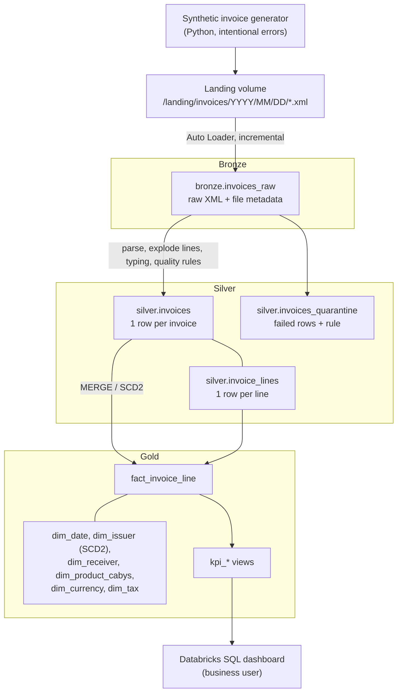

# datalakehouse-practice

A lakehouse on **Databricks** that ingests **Costa Rican electronic invoices** (XML, Ministerio de Hacienda format), processes them through a **medallion architecture** (Bronze → Silver → Gold) with **PySpark and Spark SQL**, enforces **data quality** rules, models a **star schema**, and publishes KPIs for a business user (an accountant or a small business).

> **All data is synthetic.** It is produced by [a generator in this repo](docs/data-generator.md). No real invoices, taxpayer IDs, names or amounts are used.

## The business problem

A small business in Costa Rica receives hundreds of electronic invoices from suppliers each month. Each one is an XML file. An accountant needs answers that are hard to get from a folder of XML files:

- How much VAT (IVA) was paid, and at which rate?
- Who are the main suppliers and what is being bought?
- Which invoices arrived with errors, and why?

This project turns those raw files into clean, trustworthy tables and a dashboard that answers those questions.

## Business questions (answered by the Gold layer)

1. How much VAT was paid per month and per tax rate?
2. Who are the top 10 suppliers by amount?
3. Which products or services (CABYS codes) account for most of the spend?
4. What percentage of invoices arrived with errors, and of what type?
5. How are purchases split by currency (CRC vs USD), and what is the total in CRC?
6. How does monthly spend change over time, per supplier?
7. Which suppliers changed their registered name or address, and when?

## Architecture



- **Orchestration:** Databricks Job (Bronze → Silver → Gold → quality report).
- **CI/CD:** GitHub Actions (lint + unit tests on every push and PR); deployment with Databricks Asset Bundles is planned.

Design decisions are recorded as ADRs in [docs/adr/](docs/adr/).

## Tech stack

| Area | Tools |
|---|---|
| Processing | Apache Spark (PySpark, Spark SQL) |
| Platform | Databricks Free Edition (serverless), Unity Catalog |
| Storage format | Delta Lake |
| Ingestion | Auto Loader (`cloudFiles`) |
| Testing | pytest with local PySpark |
| Quality and style | ruff |
| CI/CD | GitHub Actions, Databricks Asset Bundles (planned) |

## How the code is split

Transformations are pure functions: a DataFrame goes in and a DataFrame comes out. They are unit-tested locally with PySpark and pytest, also in CI, without Databricks credentials. Databricks-specific I/O (Auto Loader, Unity Catalog, `MERGE` into Delta) lives in thin entrypoints that run on Databricks.

## Repository layout

```
├── .github/workflows/ci.yml   # lint + tests
├── src/lakehouse/
│   ├── generator/             # synthetic invoice generator (CLI: generate-invoices)
│   ├── bronze/                # ingestion
│   ├── silver/                # parsing and data quality rules
│   ├── gold/                  # dimensions and facts
│   └── common/                # shared helpers (SparkSession, config)
├── notebooks/                 # exploration only, no production logic
├── sql/                       # grants and KPI queries
├── tests/                     # pytest + local PySpark
└── docs/                      # architecture notes, ADRs, platform notes
```

## Local development

Requirements: Python 3.11+ and Java 17 or 21 (for PySpark).

```bash
python3 -m venv .venv
source .venv/bin/activate
pip install -e ".[dev]"

ruff check .
pytest

# Generate synthetic invoices into ./data (git-ignored)
generate-invoices --invoices 1000 --days 30 --seed 42
```

See [docs/data-generator.md](docs/data-generator.md) for the XML structure, the intentional errors and the manifest.

## License

[MIT](LICENSE)
